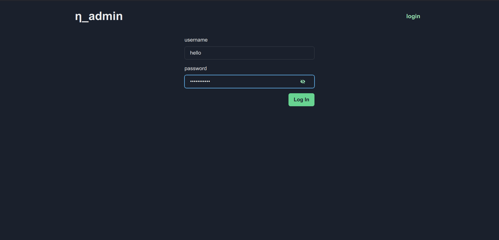
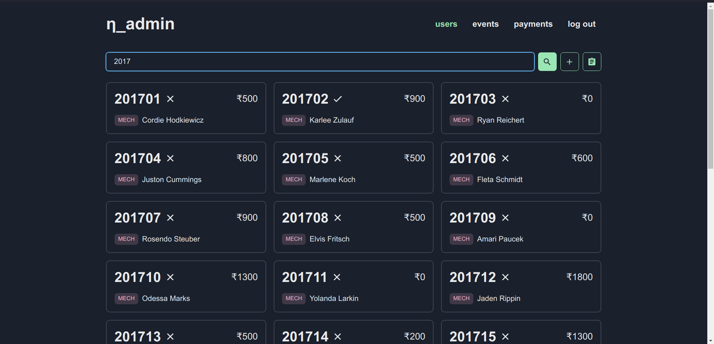
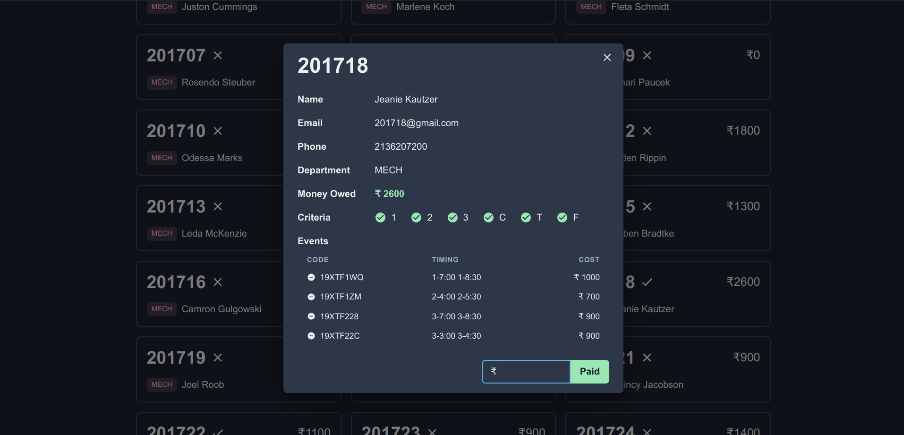
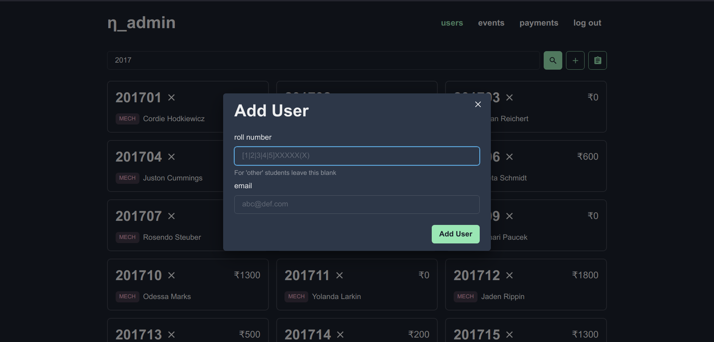
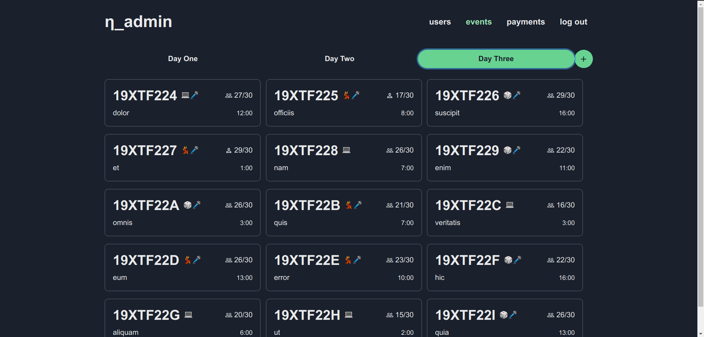
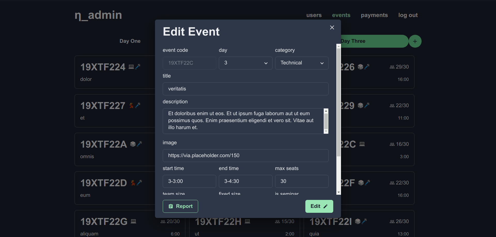
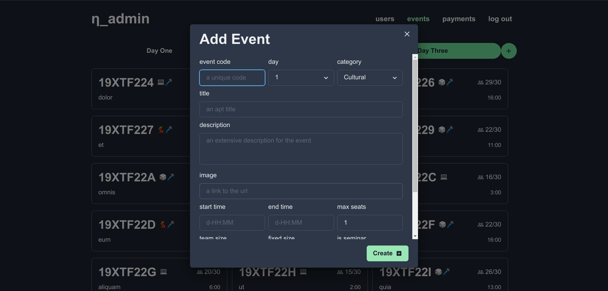
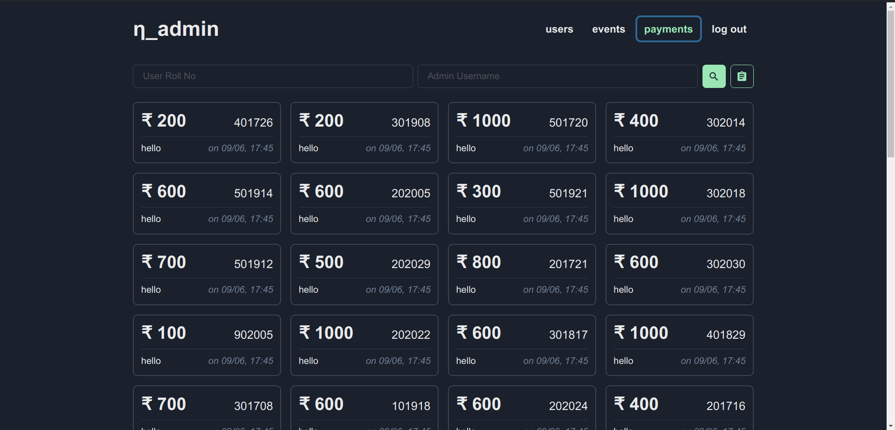

# Event Management Admin

The admin side of an event mangagement system I built for our college fest with
the MERN stack.

Click to see images

 

### Login

Authentication with sessions

### Users

Users page gives an overview of all the users registered. We can search and add
users. A report of all the students as a CSV can also be generated.

### Events

Events page contains all the events filtered by day. We can add new events here,
edit the existing ones or generate reports for each event.

### Payments

A list of all the payments made is show on the payments page. We can search
these payments based on the user's roll number or the username of the admin
who registered the payement.

## Web

- `react` as the front end framework
- `chakra-ui` a component library
- `react-icons` for icons
- `swr` for data fetching
- `downloadjs` to trigger downloads

## Server

- `express` server
  - `express-sessions` for managing sessions
  - `connect-mongo` to store the sessions in the database
- `mongodb` as database
  - `mongoose` ODM
  - `validator` for validation
  - `faker` for seeding the database
- Others
  - `argon2` for hashing
  - `pdf-creator-node` for generating reports
  - `rword` for generating passowrds
  - `nodemailer` for sending mails
